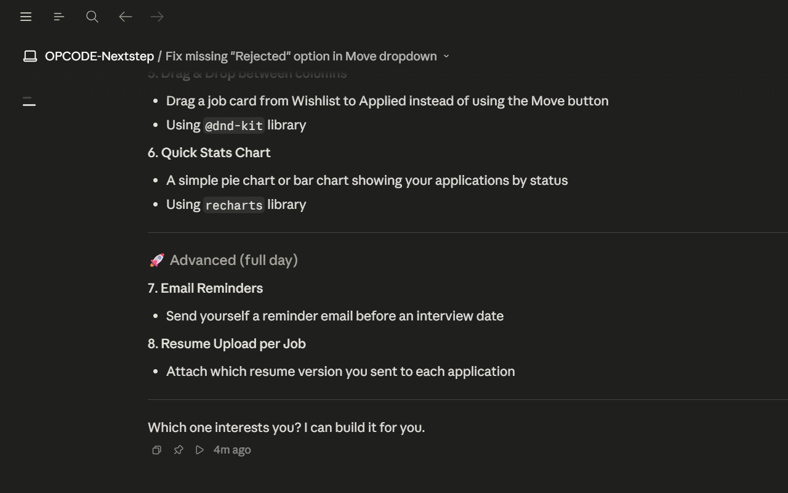

# 🚀 NextStep — Job Application Tracker

**NextStep** is a full-stack web application that helps job seekers organize, track, and manage their entire recruitment process in one place. Built as part of OPCODE Club training.

🔗 **Live Demo:** [NasBad.github.io/OPCODE-Nextstep](https://NasBad.github.io/OPCODE-Nextstep)

---



---

## 📋 What does it do?

NextStep lets you track every job application through the full recruitment lifecycle:

1. **Wishlist** — Jobs you want to apply for
2. **Applied** — Applications you already sent
3. **Interviewing** — Active interview processes
4. **Offer** — Offers you received
5. **Rejected** — Applications that didn't work out

---

## ✨ Features

- **Kanban board** and **List view**
- Add, edit, move, and archive job applications
- Status tracking with timestamps
- **Follow Up badge** — alerts when a job hasn't moved in 7+ days
- Company logos auto-fetched from company name
- Private notes per job
- Search and filter by title, company, tags
- Dark / Light mode
- User authentication (register / login / logout)
- Real backend API with JWT authentication
- Data persists per user account

---

## 🛠️ Tech Stack

| Layer | Technology |
|-------|-----------|
| Frontend | React + Vite + Material UI |
| Data Fetching | React Query + Axios |
| Routing | React Router DOM |
| Backend | Node.js + Express |
| Auth | JWT + bcrypt |
| Database | PostgreSQL + Prisma (ready to connect) |

---

## 👥 Team

| Name | GitHub | Role |
|------|--------|------|
| Mahmoud | [@mahmoudz2000](https://github.com/mahmoudz2000) | Backend lead — auth, jobs API, React Query integration |
| Naseem | [@NasBad](https://github.com/NasBad) | Frontend lead — UI, validation middleware, login/register pages |
| Tarek | — | Jobs CRUD, frontend-backend connection |

---

## 📁 Project Structure

```
OPCODE-Nextstep/
├── frontend/              # React app — the user interface
│   ├── src/
│   │   ├── api/           # axios client + API functions (jobs, auth)
│   │   ├── components/    # reusable UI components
│   │   ├── features/      # dashboard, kanban, list view
│   │   ├── pages/         # Dashboard, Archive, Login, Register
│   │   └── main.jsx       # app entry (QueryClientProvider + BrowserRouter)
│   └── package.json
└── backend/               # Express API — the server
    ├── src/
    │   ├── routes/        # auth, jobs, user, status
    │   ├── controllers/   # auth, jobs, user logic
    │   ├── middleware/     # JWT auth + input validation
    │   └── index.js       # server entry point
    ├── prisma/
    │   └── schema.prisma  # database schema (User + Job)
    └── package.json
```

---

## 🖥️ Running Locally

> You need two terminals open at the same time.

**Terminal 1 — Backend**
```bash
cd backend
npm install
cp .env.example .env   # fill in your values
npm run dev
```
Runs on `http://localhost:5000`

**Terminal 2 — Frontend**
```bash
cd frontend
npm install
npm run dev
```
Runs on `http://localhost:5173`

> **Note:** The GitHub Pages demo uses mock data and doesn't require the backend. The full experience (real login, data saved per user) requires running both servers locally.

---

## 🌿 Git Rules

- Branch naming: `frontend/feature-name` or `backend/feature-name`
- Never push directly to `main`
- Always open a PR and wait for review before merging
- Test backend endpoints with Postman before opening a PR

---

*NextStep — OPCODE Club*
